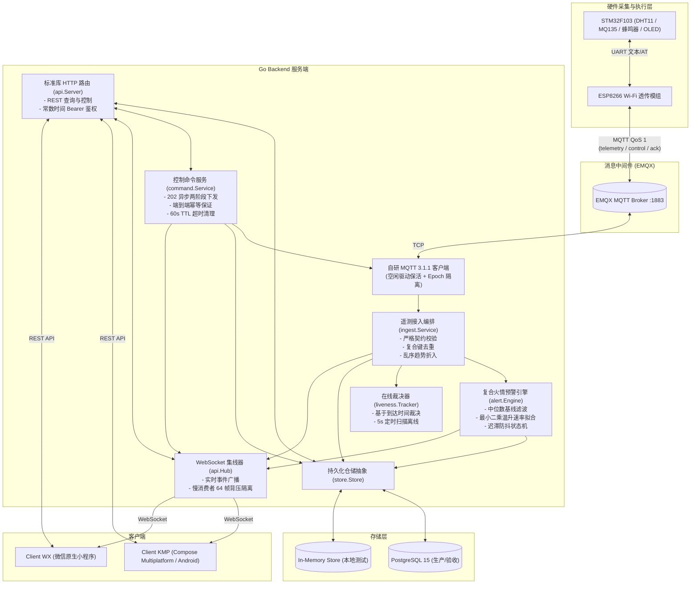
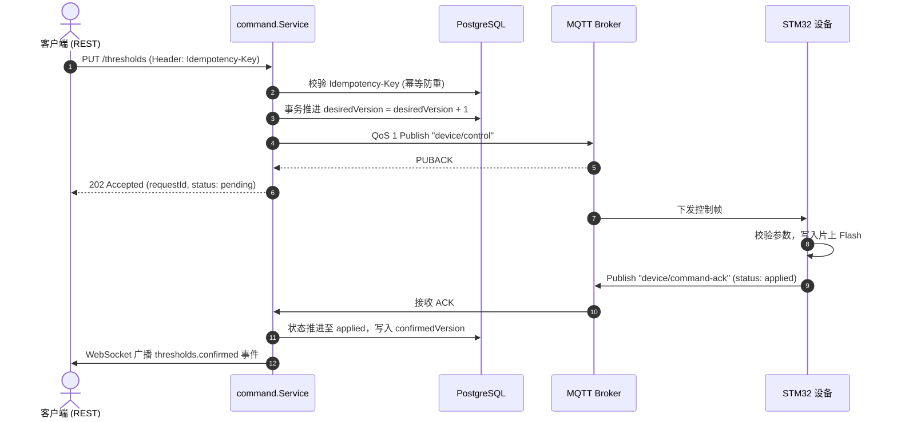

# Backend 系统架构与核心设计决策手册

本文档详细说明 Go Backend 在软硬件综合实训项目中的系统架构、算法数学模型推导、两阶段控制闭环、接入层时序保障及关键工程设计决策。

---

## 1. 系统全链路架构与数据流拓扑

在全链路（Hardware → MQTT Broker → Go Backend → Clients）中，后端承担承上启下的核心枢纽职责。



---

## 2. 复合火情早期预警算法推导与状态机

在实验室与机房场景下，单传感器误报率高：
- 单独 MQ135 浓度突增：可能仅是实验员开启了乙醇溶剂瓶；
- 单独温度上升：可能仅为空调周期性启停或机柜风道调整。

因此后端采用**双因子复合火情早期预警算法**（`alert.Engine`）。

### 2.1 数学模型与计算原理

#### A. 中位数气体基线滤波（Median Baseline Filter）
由于传感器可能存在瞬时电气毛刺，算法不采用简单均值（Mean），而采用滑动窗口前 $\max(3, \lfloor N/3 \rfloor)$ 个样本计算**中位数**作为环境本底基线 $B_{gas}$：

$$\text{baseline} = \text{median}\left(\{\text{gasAdcFiltered}_0, \dots, \text{gasAdcFiltered}_{k-1}\}\right)$$

最新有效增量：
$$\Delta \text{gas} = \text{gasAdcFiltered}_{\text{latest}} - \text{baseline}$$

判定条件：
$$\text{gasSurge} \iff \Delta \text{gas} \ge \text{ALERT\_GAS\_RISE\_ADC (默认 150 码)}$$

> **为什么采用 12 位 ADC 码（0~4095）而非 ppm？**
> MQ135 在未进行标准气体标定箱标定的情况下，转换出的 ppm 属于估算值，绝对精度较低；但发生烟雾或可燃气体泄漏时，其 ADC 采样值的激增是单调且必然的。直接基于 ADC 差值判断具有更强的抗漂移能力。

#### B. 最小二乘法温升速率拟合（OLS Linear Regression）
为滤除传感器量化噪声，温升速率不是简单计算相邻两点差值，而是对滑动窗口内所有采样点集 $(t_i, T_i)$ 进行一元线性拟合：

令时间以窗口第一个样本为基准：$x_i = t_i - t_0$（秒），温度 $y_i = T_i$（°C）。
拟合直线斜率 $k$（°C/s）：

$$k = \frac{n \sum_{i=1}^n x_i y_i - \sum_{i=1}^n x_i \sum_{i=1}^n y_i}{n \sum_{i=1}^n x_i^2 - \left(\sum_{i=1}^n x_i\right)^2}$$

折算为每分钟温升速率：
$$\text{temperatureRate} = k \times 60 \quad (^\circ\text{C}/\text{min})$$

判定条件：
$$\text{rapidRise} \iff \text{temperatureRate} \ge \text{ALERT\_TEMP\_RATE\_C\_PER\_MIN (默认 3.0 }^\circ\text{C}/\text{min})$$

### 2.2 防抖机制与四状态机转移

状态集合：`normal`、`suspect`、`fire_warning`、`recovered`。

```text
       ┌───────────────┐
       │    normal     │ ◄───────────────────────────┐ (无历史告警)
       └──────┬────────┘                             │
              │ 单因子触发                           │
              ▼                                      │
       ┌───────────────┐                             │
       │    suspect    │ ◄──────────┐                │
       └──────┬────────┘            │                │
              │ 双因子满足          │ 仅单因子       │
              │ 且 N>=6, t>=20s     │ (事件未闭合)   │
              ▼                     │                │
       ┌───────────────┐            │                │
       │ fire_warning  ├────────────┘                │
       └──────┬────────┘                             │
              │ 条件全部解除                         │
              │ 且持续保持 30s (RecoveryHold)        │
              ▼                                      │
       ┌───────────────┐                             │
       │   recovered   ├─────────────────────────────┘
       └───────────────┘ (保留历史告警痕迹)
```

1. **单次采样绝不触发火警**：必须满足 $N \ge 6$（`MinSamples`）且时间跨度 $\ge 20\text{s}$（`MinDuration`）；
2. **迟滞防抖（Recovery Hold）**：条件全部解除后，不立即闭合报警，必须连续保持 30 秒（`RecoveryHold`），一旦期间再次超标则重置计时，杜绝临界点频繁翻转；
3. **设备重启重置窗口**：若上报数据的 `bootId` 变化，表明单片机发生重启，窗口全部丢弃，防止跨重启的电位跳变误判。

---

## 3. 控制命令生命周期与闭环确认机制

远程控制（设置阈值、蜂鸣器静音）涉及软硬件交互，网络不可靠时极易发生控制丢失或乱序。后端实现了严密的**两阶段确认与端到端幂等**。



### 3.1 核心设计决策
1. **HTTP 202 真实语义**：202 Accepted 仅代表服务端接受指令并已可靠投递至 MQTT Broker，**绝不代表硬件已执行完成**；
2. **端到端幂等键（Idempotency-Key）**：
   - 相同 Key、相同内容：返回已存在的原命令记录，**不二次发包**；
   - 相同 Key、不同内容：返回 `409 version_conflict` 阻断潜在的重放篡改；
3. **Flash 校验闭环**：设备成功写 Flash 并回执 `applied` 后，后端才推进 `confirmedVersion`。若 ACK 丢失，后续遥测中上报的 `thresholdVersion` 仍能作为备选证据收敛版本状态；
4. **命令 TTL 与防延迟误触**：命令生命周期为 60 秒。后台每 5 秒扫描过期命令，标记为 `timed_out`。**设备离线重连后绝不补发过期命令**，避免在设备脱离监管后突然受到迟到指令的危险干扰。

---

## 4. 接入层防重、时序与乱序保护

1. **唯一去重键**：
   数据库 `telemetry` 表建立唯一索引：
   ```sql
   CONSTRAINT telemetry_dedup_key UNIQUE (device_id, boot_id, sequence)
   ```
   单片机每次掉电复位后内部 `sequence` 计数器归零，联合 `boot_id`（每次开机生成的唯一随机批次号）构成立体唯一键，防止断电重启后的有效数据被误判为重复报文丢弃。
2. **迟到样本处理策略**：
   网络抖动导致的晚到样本（比当前已入库最新样本更旧）：
   - 折入告警引擎窗口（`engine.Ingest`），保持历史统计趋势曲线连续；
   - **绝不推动当前设备状态快照**，不刷新 `lastSeenAt`，防止陈旧状态覆写最新现实。

---

## 5. 自研 MQTT 3.1.1 客户端核心突破

不依赖臃肿的第三方库，自研高可靠 MQTT 3.1.1 协议子集（`internal/mqtt`）：

1. **空闲驱动保活（Idle-driven KeepAlive）**：
   MQTT 规范要求任意两个控制报文间隔不超过 1.5 倍 KeepAlive。客户端记录每次实际发包时间戳 `lastSend`：只要有业务报文发送就自动顺延下一次 Ping；仅在链路空闲达到 `KeepAlive / 2`（15秒）才发送 PINGREQ，为突发抖动预留足量网络预算。
2. **Epoch 隔离的 QoS 1 等待队列**：
   每个发送请求由 `(packetID, connEpoch)` 联合锁定。若网络发生闪断重连，旧连接的所有 Waiter 立即全部以 `ErrConnectionLost` 失败结束，绝不允许新连接上偶然相同的 PacketID 跨会话错误确认旧命令。

---

## 6. 存储抽象与一致性测试（Conformance Test）

1. **统一仓储接口**：`store.Store` 隔离业务与数据库驱动；
2. **开箱即用双实现**：
   - `store.Memory`：用于单元测试与本地免数据库快速运行；
   - `store.Postgres`：基于 `pgx/v5`，内嵌幂等迁移（`migrations/`）；
3. **共享一致性套件**：`conformance_test.go` 对两套实现运行完全一致的测试集，杜绝实现间行为漂移；
4. **稳定游标分页（Keyset Pagination）**：
   采用 `(event_time, boot_id, sequence)` 组合游标，保证即便在毫秒级多条数据并发入库时，历史数据分页也绝不发生漏页或重复。
